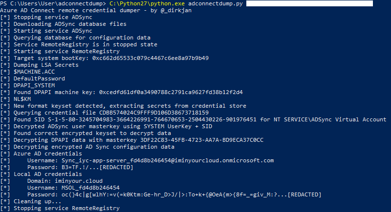

# Azure AD Connect / Entra ID Connect kimlik bilgisi çıkarma araçları (Türkçe)

> Bu depo, [dirkjanm/adconnectdump](https://github.com/dirkjanm/adconnectdump) projesinin Türkçe yorum satırları ve konsol/log mesajları içeren bir uyarlamasıdır. Orijinal proje **MIT Lisansı** ile yayınlanmıştır; bu uyarlama da aynı lisans altında, orijinal telif bildirimi (Dirk-jan Mollema) korunarak sunulmaktadır. Komut satırı argümanları (`-hashes`, `-k`, `-dc-ip` gibi) uyumluluk için İngilizce bırakılmıştır.

[](https://dev.azure.com/dirkjanm/adconnectdump/_build/latest?definitionId=20&branchName=master)

Bu araç seti, Entra ID Connect sunucularından saklanan Entra ID (Azure AD) ve Active Directory kimlik bilgilerini çıkarmak ve şifresini çözmek için çeşitli yöntemler sunar. Bu kimlik bilgileri hem şirket içi (on-premise) dizinde hem de bulutta yüksek ayrıcalıklara sahiptir. Araçlar ilk olarak TROOPERS 19'daki Azure AD sunumumun bir parçası olarak yayınlandı. Teknik arka plan hakkında daha fazla bilgi için sunumu [YouTube'da](https://www.youtube.com/watch?v=JEIR5oGCwdg) izleyebilir veya slaytları [buradan](https://www.slideshare.net/DirkjanMollema/im-in-your-cloud-reading-everyones-email-hacking-azure-ad-via-active-directory) görüntüleyebilirsiniz.

Kimlik bilgilerinin saklama yönteminin 2019 sonunda değiştiğine dikkat edin. ADSyncDecrypt aracı, kimlik bilgilerini DPAPI üzerinden çıkarmak için otomatik olarak `NT SERVICE\ADSync` servisini taklit eder (impersonate). ADSyncGather, güncellenmiş kimlik bilgisi saklama yöntemiyle uyumlu değildir, ancak adconnectdump.py/ADSyncQuery çalışmaya devam eder. Bu yöntemin iç işleyişi [bu blog yazısında](https://dirkjanm.io/updating-adconnectdump-a-journey-into-dpapi/) anlatılmaktadır.

2025 yılında Microsoft, Entra ID Connect için kullanıcı hesabı yerine bir Service Principal (Hizmet Sorumlusu) kimliği kullanma seçeneğini tanıttı. ADSyncCertDump aracı bununla uyumludur. Bu aracın kodu, Ceri Coburn'ün [Shwmae](https://github.com/CCob/Shwmae) projesine dayanmaktadır ve BSD-3-Clause lisansı altında kullanılmaktadır.

# Araç Karşılaştırması

Bu depo, kimlik bilgilerini çıkarmak için 3 farklı yöntem sunar.
- **ADSyncDecrypt**: Kimlik bilgilerinin şifresini tamamen hedef sunucu üzerinde çözer. AD Connect DLL'lerinin PATH içinde olmasını gerektirir. Adam Chester tarafından [blogunda](https://blog.xpnsec.com/azuread-connect-for-redteam/) benzer bir PowerShell sürümü yayınlanmıştır.
- **ADSyncGather**: Hedef sunucudan kimlik bilgilerini ve şifreleme anahtarlarını sorgular, şifre çözme işlemi yerel olarak (python ile) yapılır. DLL bağımlılığı yoktur.
- **ADSyncQuery**: Yerel olarak kaydedilen veritabanından kimlik bilgilerini sorgular. MSSQL LocalDB kurulu olmasını gerektirir. DLL bağımlılığı yoktur. `adconnectdump.py` tarafından çağrılır, Azure AD connect sunucusunda hiçbir şey çalıştırmadan veri döker.
- **ADSyncCertDump**: Service Principal tabanlı kurulumlar içindir. Anahtar yazılım tabanlıysa sertifikayı ve özel anahtarı (private key) döker; anahtar TPM'de saklanıyorsa roadtx ile kullanılabilecek bir onaylama (assertion) oluşturur. Hedef sunucuda Administrator ayrıcalıklarıyla çalıştırılması gerekir.
- **ADSyncDump-BOF**: Beacon Object File (BOF) çalıştırmayı destekleyen herhangi bir C2 çerçevesi üzerinden, PATH içinde AD Connect DLL'lerine ihtiyaç duymadan kimlik bilgilerinin şifresini tamamen hedef sunucu üzerinde çözer.

Aşağıdaki tablo, teknikler arasındaki farkları özetlemektedir:

Araç | Hedefte kod çalıştırma gerektirir | DLL bağımlılığı | Yerel MSSQL gerektirir | Yerel python gerektirir | SP tabanlı kurulumla uyumlu
--- | --- | --- | --- | --- | ---
ADSyncDecrypt | Evet | Evet | Hayır | Hayır | Hayır
ADSyncGather | Evet | Hayır | Hayır | Evet | Hayır
ADSyncQuery | Hayır (yalnızca ağ üzerinden RPC çağrıları) | Hayır | Evet | Evet | Hayır
ADSyncCertDump | Evet | Hayır | Hayır | Hayır | Evet
ADSyncDump-BOF | Evet | Hayır | Hayır | Hayır | Hayır

# Kullanım

## ADSyncDecrypt
Gerekli DLL'lerin bulunduğu bir konumdan, Azure AD connect sunucusunda admin olarak çalıştırın (varsayılan olarak AD Connect `C:\Program Files\Microsoft Azure AD Sync\Bin` dizinine kurulur). Size yapılandırma XML'ini ve şifresi çözülmüş yapılandırmayı verecektir.

## ADSyncGather (yalnızca eski yapılandırma)
ADSyncGather.exe dosyasını Azure AD connect sunucusunda (Administrator olarak) çalıştırın, örneğin `execute-assembly` ile bellek üzerinden. Çıktıyı bir dosyaya kaydedip `decrypt.py` ile ayrıştırın:
```
F:\> decrypt.py .\output.txt utf-16-le
Azure AD credentials
        Username: Sync_o365-app-server_206b1a1ede1f@frozenliquids.onmicrosoft.com
        Password: :&A!>rWD...[REDACTED]
Local AD credentials
        Domain: office.local
        Username: MSOL_206b1a1ede1f
        Password: )JH|L;hO2UUVIE*T>k[6R2.S!l%Wdxmf(@w_tYlEA:5{G)Ka[sT|E0E[9>m!(N=...[REDACTED]
```

## ADSyncQuery / adconnectdump.py
`adconnectdump.py`'yi Windows'tan çağırmalısınız. Azure AD connect kimlik bilgilerini, secretsdump.py'ye benzer şekilde ağ üzerinden döker (bunu çalıştırmak için [impacket](https://github.com/SecureAuthCorp/impacket) ve `pycryptodomex` kurulu olmalıdır). ADSyncQuery.exe, indirilen veritabanını ayrıştırmak için kullanılacağından aynı dizinde bulunmalıdır (bu, sunucunuzda MSSQL LocalDB kurulu olmasını gerektirir).



Alternatif olarak, aracı herhangi bir işletim sisteminde çalıştırıp veritabanını indirmesini ve hata vermesini bekleyebilir, ardından mdf ve ldf dosyalarını MSSQL kurulu Windows makinenize kopyalayıp `ADSyncQuery.exe c:\mutlak\yol\ADSync.mdf > out.txt` komutunu çalıştırabilir ve bu `out.txt` dosyasını, Azure AD connect sunucusuna erişebilen sisteminizde `--existing-db` ve `--from-file out.txt` seçenekleriyle kullanarak işlemin geri kalanını yapabilirsiniz.

## ADSyncCertDump
ADSyncCertDump aracı, modern kurulumlarda Entra ID connect için kullanılan Service Principal'in kimlik bilgilerini veya onaylamasını (assertion) çıkarmak içindir. Böyle bir kurulum kullanılıyorsa, ADSyncDecrypt size kimlik bilgileri yerine bir _client id_ ve bir _sertifika parmak izi (thumbprint)_ verecektir. Bu parametreler ADSyncCertDump'a verilebilir; anahtar yazılım anahtarı olarak saklanıyorsa sertifikayı ve özel anahtarı çıkarır. Donanım anahtarı olarak saklanıyorsa, _roadtx appauth_ ile kullanabileceğiniz bir onaylama (assertion) oluşturur (ayrıntılar için [roadtx wiki](https://github.com/dirkjanm/ROADtools/wiki/ROADtools-Token-eXchange-\(roadtx\)) sayfasına bakın).

```
Kullanim: ADSyncCertDump.exe <sertifika parmak izi> <client_id> <tenant_id>
```

## ADSyncDump-BOF
[ADSyncDump-BOF](https://github.com/Paradoxis/ADSyncDump-BOF), @Paradoxis tarafından yazılmış, ADSyncDecrypt'in bir Beacon Object File (BOF) varyantıdır; ancak şifre çözme için herhangi bir harici DLL'e bağımlı değildir ve BOF'ları destekleyen herhangi bir C2 çerçevesinden (ör. Cobalt Strike, Sliver) çalıştırılabilir. Araç yalnızca parolaları ADSync veritabanında saklayan eski (legacy) kurulumu hedefler, yeni service-principal kurulumunu değil. BOF `make` ile derlenebilir ve varsayılan olarak Cobalt Strike & Sliver'da tek bir komutla çalıştırılabilir:

```
beacon> adsyncdump
Found 'miiserver.exe' with PID: 5176
Using ODBC driver: ODBC Driver 17 for SQL Server

Successfully obtained ADSync instance metadata:

        Instance ID: REDACTED
        Entropy ID: REDACTED
        Keyset ID: REDACTED

Successfully obtained ADSync instance key materials.
Successfully impersonated ADSync database server token.
Successfully decrypted ADSync configuration.

        ADSync username: Sync_DC01_REDACTED@REDACTED.onmicrosoft.com
        ADSync password: REDACTED
```

*Not: Bu BOF çıktısı, harici (dışarıdan derlenmiş) bir bileşen olduğu için orijinal İngilizce haliyle bırakılmıştır.*

## Kaynak
Orijinal proje: https://github.com/dirkjanm/adconnectdump
